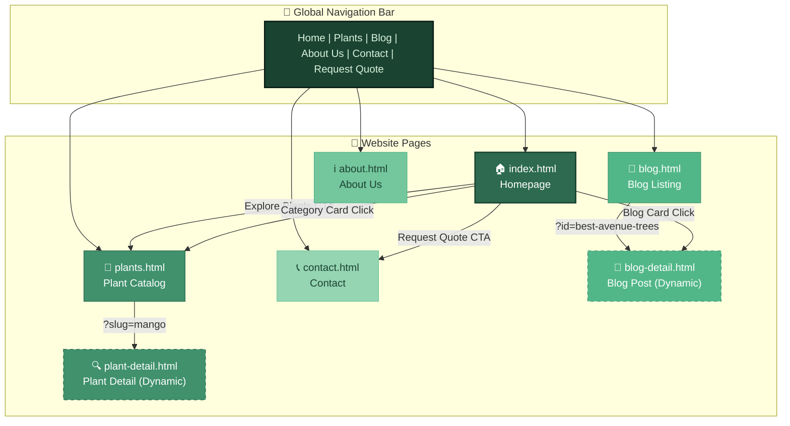
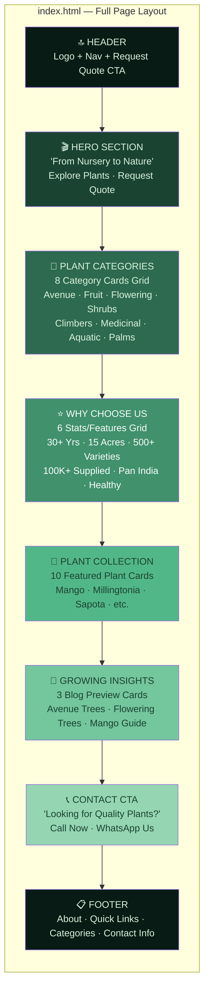
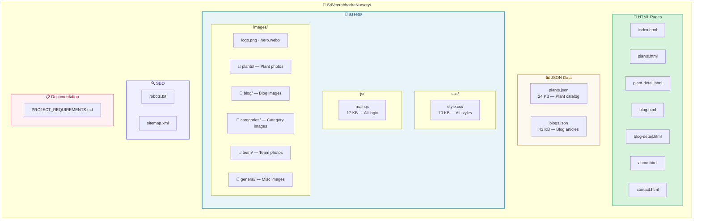
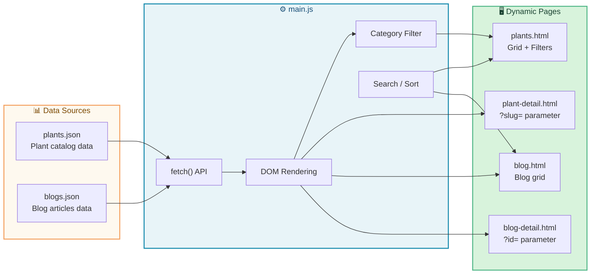
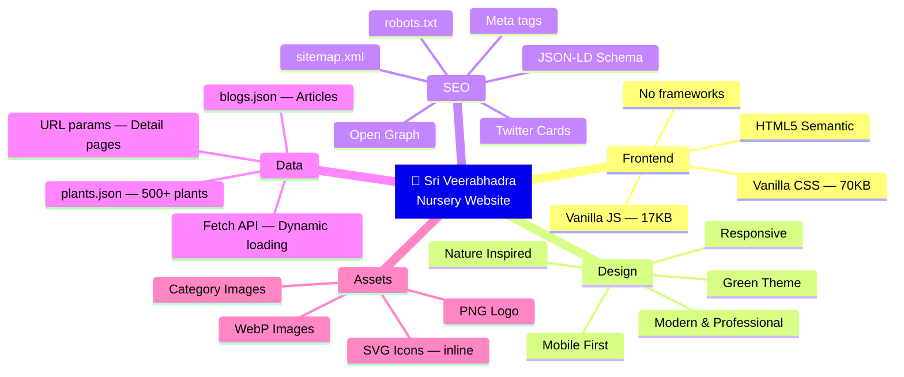
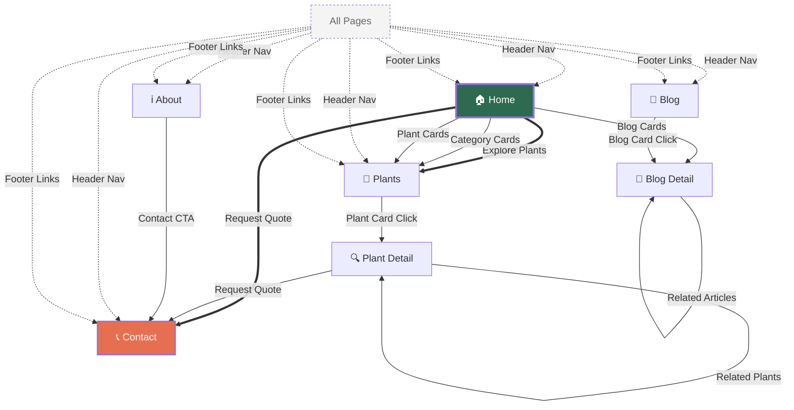

# 🌿 Sri Veerabhadra Nursery & Gardens — Visual Project Overview

> **Phase 1 Static Website** · HTML + CSS + JavaScript · No CMS / No Backend

---

## 🗺️ Site Map & Navigation Flow

---

## 🏠 Homepage Section Breakdown

---

## 📁 File & Folder Structure

---

## 🔄 Data Flow & Dynamic Content

---

## 📐 Page Architecture Summary

| Page | File | Key Sections | Data Source |
|------|------|-------------|-------------|
| **Home** | [index.html](file:///d:/SriVeerabhadraNursery/index.html) | Hero → Categories (8) → Why Us (6) → Plants (10) → Blog (3) → CTA → Footer | Static HTML |
| **Plants** | [plants.html](file:///d:/SriVeerabhadraNursery/plants.html) | Hero → Filters → Plant Grid → Footer | [plants.json](file:///d:/SriVeerabhadraNursery/plants.json) |
| **Plant Detail** | [plant-detail.html](file:///d:/SriVeerabhadraNursery/plant-detail.html) | Hero → Plant Info → Related → Footer | [plants.json](file:///d:/SriVeerabhadraNursery/plants.json) via `?slug=` |
| **Blog** | [blog.html](file:///d:/SriVeerabhadraNursery/blog.html) | Hero → Blog Grid → Footer | [blogs.json](file:///d:/SriVeerabhadraNursery/blogs.json) |
| **Blog Detail** | [blog-detail.html](file:///d:/SriVeerabhadraNursery/blog-detail.html) | Hero → Article → Related → Footer | [blogs.json](file:///d:/SriVeerabhadraNursery/blogs.json) via `?id=` |
| **About** | [about.html](file:///d:/SriVeerabhadraNursery/about.html) | Hero → Story → Team → Mission → Footer | Static HTML |
| **Contact** | [contact.html](file:///d:/SriVeerabhadraNursery/contact.html) | Hero → Contact Form → Info → Map → Footer | Static HTML |

---

## 🎨 Technology & Design Stack

---

## 🔗 Internal Linking Map

---

> **Summary**: A clean 7-page static nursery website with JSON-driven dynamic content for plants and blogs, full SEO setup, and a nature-inspired green theme. All styling in one CSS file, all logic in one JS file.
